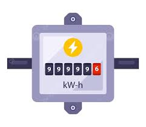

# EQUIPO 03
## Integrantes
- Yhonaiker Ramos Garay--- Coordinador general yhonaiker.ramos@upch.pe
- Glicerio Urbano Castillo--- Investigador y programador glicerio.urbano@upch.pe
- Jhair Cueva Tantalean---- Diseñador de prototipado electronico   pedro.cueva@upch.pe
- Junior Moises Aliaga Cueva--- Supervisor de github y manufactura digital junior.aliaga@upch.pe 
### Presentación 
Este proyecto fue desarrollado en el marco de la materia Fundamentos de Diseño, tomando como eje un Objetivo de Desarrollo Sostenible (ODS).
El propósito es combinar investigación, creatividad y diseño para proponer una solución visual, conceptual y comunicativa que genere conciencia y acción en torno a nuestro ODS seleccionado
## ODS ELEGIDA
- ODS 12 produccion y consumo responsable 
### Idea elegida 
- Medidor Inteligente de Consumo Eléctrico es un sistema basado en IoT que monitorea de forma independiente el consumo eléctrico en cada habitación de una casa.
Cada cuarto cuenta con un sensor de corriente que mide el consumo.
Los datos se envían a una plataforma digital app o sitio web
Si una habitación supera un umbral de consumo excesivo, el sistema activa:
- Alarma sonora o visual.
- Notificación en el celular.
#### Con esto se busca reducir el consumo excesivo de energia electrica en una casa aparter de darnos cuenta en que habitacion es donde esta consumiendo mas energia.
![Esquema del sistema]
