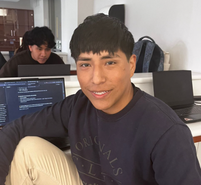

# Equipo 03 - Fundamentos de Diseño 2025-2
**Carrera de Ingeniería Ambiental / Informática / Industrial**  
**Universidad Peruana Cayetano Heredia**

## 📑 Tabla de Contenidos
- 👥 Descripción del Equipo
- 📸 Fotografía del Equipo
- 🧑‍🤝‍🧑 Integrantes
- 📘 Resumen Final
- 💡 Proyecto: KOLCAPP
- 🎯 Objetivos
- 🔍 ¿Cómo Funciona?
- 📱 Características de la Aplicación
- 🌱 Impacto Esperado
- 🚀 Misión y Visión
- 📌 Justificación
- ♻️ Alineación con ODS 12
- 🧩 Componentes Clave del Sistema
- 📊 Especificaciones Técnicas
- 🔬 Metodología de Implementación
- 📈 Métricas de Impacto

---

## 🌍 Descripción del Equipo
Somos el Equipo 03 del curso Fundamentos de Diseño 2025-2, conformado por estudiantes de la carrera de Ingeniería Ambiental / Informática / Industrial.

Nuestro objetivo es aplicar la metodología de diseño para generar soluciones innovadoras con impacto social, tecnológico y ambiental.

**Nos interesa trabajar en los siguientes Objetivos de Desarrollo Sostenible (ODS):**
- **ODS 12**: Producción y consumo responsable

---

## 📸 Fotografía del Equipo

**Equipo 03**

---

## 👥 Integrantes del Equipo

| Foto | Nombre | Rol | Intereses |
|------|--------|-----|-----------|
| | **Yhonaiker Ramos Garay** | Líder del equipo | Innovación social, sostenibilidad |
|| **Glicerio Leonel Urbano Castillo** | Responsable de investigación | Gestión ambiental, desarrollo comunitario |
| | **Pedro Jhair Cueva Tantalean** | Diseñador/a | Diseño de prototipos, creatividad aplicada |
| | **Junior Moises Aliaga Cueva** | Encargado/a de documentación | Comunicación científica, redacción técnica |

---

## 📌 Resumen Final

### 🌍 Proyecto ODS 12 - Fundamentos de Diseño

**¿Quiénes somos?**  
Somos un grupo de estudiantes del curso Fundamentos de Diseño, comprometidos en aplicar la creatividad y el pensamiento crítico para desarrollar soluciones innovadoras que aporten al desarrollo sostenible.

**Nuestra motivación**  
"La preocupación por el  desperdicio de productos vencidos o próximos a caducar en bodegas y tiendas de mi localidad nos impulsó a crear Kolcapp. Este proyecto nace para combatir y reducir significativamente las pérdidas en el comercio minorista de nuestro país, buscando un mejor destino para esos recursos."

**ODS seleccionado**: Objetivo 12 - Producción y Consumo Responsables

---

## 💡 PROYECTO: Kolcapp

### Descripción GeneraL
Kolcapp es una aplicación móvil innovadora que conecta tiendas, bodegas y supermercados con productos próximos a vencer con consumidores interesados en adquirirlos a precios reducidos. La plataforma integra tecnología de geolocalización, notificaciones inteligentes y un sistema de descuentos progresivos para maximizar el aprovechamiento de alimentos y minimizar el desperdicio.

---

## 🎯 Objetivos

### 1. Objetivo General
Diseñar e implementar una aplicación móvil dirigida a tiendas y bodegas ubicados en zonas periféricas, permitiéndoles registrar productos envasados próximos a vencer y ofrecerlos con descuentos significativos, con el fin de reducir el desperdicio de alimentos, minimizar pérdidas económicas y fomentar el consumo responsable en áreas con menor movimiento comercial.

### 2. Objetivos Específicos

| Nº | Objetivo |
|----|----------|
| 1 | Diseñar una interfaz simple y accesible para que tanto comerciantes como clientes de todas las edades puedan usar la plataforma sin dificultad. |
| 2 | Reducir el desperdicio de productos envasados próximos a vencer en tiendas periféricas, mediante descuentos progresivos y alertas de vencimiento. |
| 3 | Generar ahorro económico para los usuarios mediante compras más accesibles. |
| 4 | Contribuir al cumplimiento de la ODS 12 mediante la reducción de pérdidas de alimentos en la cadena de suministro. |

---

## 🔍 ¿Cómo Funciona?

### Sistema Integrado de Gestión:

**Para Comerciantes:**
1. **Registro de Productos**: Escaneo de códigos de barras o registro manual con fecha de vencimiento
2. **Sistema de Descuentos Automáticos**: Algoritmo que aplica descuentos progresivos según proximidad al vencimiento:
   - 7-5 días: 15% descuento
   - 4-3 días: 30% descuento
   - 2-1 días: 50% descuento
   - Día de vencimiento: 70% descuento
3. **Gestión de Inventario**: Panel de control para monitorear productos registrados y ventas

**Para Consumidores:**
1. **Búsqueda Geolocalizada**: Encuentra ofertas cercanas mediante GPS
2. **Filtros Inteligentes**: Por categoría de producto, rango de precios, distancia
3. **Notificaciones Push**: Alertas personalizadas sobre ofertas que coinciden con preferencias
4. **Sistema de Reservas**: Posibilidad de apartar productos por tiempo limitado

### Tecnologías y Funcionalidades Específicas:

| Componente | Tecnología | Función |
|------------|------------|---------|
| **Reconocimiento de Productos** | API de códigos de barras | Identificación automática de productos y fechas de vencimiento |
| **Geolocalización** | Google Maps API | Localización de tiendas cercanas y cálculo de rutas |
| **Notificaciones** | Firebase Cloud Messaging | Alertas push personalizadas en tiempo real |
| **Pagos** | Integración con Yape/Plin | Pagos seguros y rápidos |
| **Base de Datos** | MySQL, Firebase | función principal es almacenar, organizar, gestionar y recuperar datos de manera eficiente y estructurada
| **Análisis de Datos** | Machine Learning | Predicción de patrones de compra y optimización de descuentos |

---

## 📱 Kolcapp - Características Principales

### **Interfaz para Comerciantes - "Kolcapp"**

**Dashboard Principal:**
- ✅ Inventario de productos próximos a vencer
- ✅ Alertas automáticas cuando productos se acercan al vencimiento
- ✅ Gestión de descuentos personalizados

**Funciones Clave:**
- 📷 Escaneo rápido de códigos de barras
- 📊 Reportes mensuales de reducción de pérdidas
- 🔔 Notificaciones para reposición de stock
- 💰 Calculadora de rentabilidad con descuentos

### **Interfaz para Consumidores - "KOLCAPP"**

**Pantalla Principal:**
- 🗺️ Mapa interactivo con ofertas cercanas
- 🏪 Lista de tiendas participantes
- 🎯 Ofertas destacadas del día
- 💡 Sugerencias basadas en historial de compras

**Funciones Clave:**
- 🔍 Búsqueda por categorías ( Productos envasados etc.)
- ⭐ Sistema de valoraciones de tiendas
- 📱 Código QR para retiro rápido
- 📈 Tracker personal de ahorro mensual
- 🏆 Sistema de puntos por compras sostenibles

### **Notificaciones Inteligentes:**
- **"🔥 OFERTA FLASH: Yogures con 60% descuento en Bodega San Juan - ¡Solo por hoy!"**
- **"🥖 PANADERÍA: Pan del día anterior con 40% descuento a 2 cuadras de ti"**
- **"📊 RESUMEN SEMANAL: Ahorraste S/ 25.50 y evitaste desperdiciar 3kg de alimentos"**
- **"🎯 RECOMENDACIÓN: Productos que sueles comprar disponibles con descuento"**

---

## 🌱 Impacto Esperado

| Dimensión | Impacto |
|-----------|---------|
| **Ambiental** | Reducción del desperdicio de alimentos y del uso innecesario de recursos naturales. |
| **Económica** | Ahorro económico para los consumidores y optimización de inventarios para los comercios. |
| **Social** | Apoyo a pequeños negocios y mayor acceso a alimentos para la población. |
| **Sostenible** | Promoción de la economía circular y fortalecimiento de hábitos de consumo responsable. |

---

## 🚀 Misión
Implementar prácticas sostenibles en el consumo y la distribución de alimentos, reduciendo el desperdicio y fomentando la economía circular. Mediante la innovación tecnológica y la colaboración multidisciplinaria, se busca construir un presente en el que el acceso a alimentos asequibles y la reducción de pérdidas sean pilares de un sistema alimentario más justo y sostenible.

## 🔮 Visión
Visualizamos un futuro en el que cada alimento sea aprovechado y no se convierta en desperdicio, transformándolo en oportunidades de ahorro, eficiencia y sostenibilidad. Aspiramos a un mundo donde la tecnología y la creatividad fortalezcan cadenas de suministro responsables, impulsando un cambio global hacia el consumo consciente y la producción sostenible, en armonía con la naturaleza y las necesidades de la humanidad.

---

## 📌 Justificación
El desperdicio de alimentos es un problema global con repercusiones ambientales, económicas y sociales:

- Cada año se pierden millones de toneladas de alimentos, mientras numerosas familias enfrentan dificultades para acceder a ellos.
- Estas pérdidas implican un uso excesivo de recursos naturales (agua, suelo, energía).
- Se generan emisiones contaminantes que agravan el cambio climático.

**KOLCAPP representa una solución práctica e innovadora que:**
- Facilita la conexión entre oferta y demanda de alimentos próximos a vencer.
- Reduce el desperdicio y las emisiones asociadas.
- Genera ahorro económico para los consumidores.
- Promueve una cultura de consumo responsable y de economía circular.

---

## ♻️ Alineación con el ODS 12

### 📊 IMPACTO EN EL ODS 12: PRODUCCIÓN Y CONSUMO RESPONSABLES

#### 🎯 Meta 12.3: Reducción del Desperdicio de Alimentos
*"De aquí a 2030, reducir a la mitad el desperdicio de alimentos per cápita nacional"*

| Indicador | Impacto de KOLCAPP |
|-----------|-------------------------|
| Reducción de desperdicio | Sistema de descuentos progresivos que incentiva compra antes del vencimiento |
| Optimización del consumo | Alertas proactivas sobre ofertas cercanas y fechas de vencimiento |
| Gestión eficiente | Conexión directa entre oferta y demanda local |

#### ♻️ Meta 12.5: Reducción de Generación de Desechos
*"Reducir considerablemente la generación de desechos mediante actividades de prevención, reducción, reciclado y reutilización"*

| Indicador | Impacto de KOLCAPP |
|-----------|-------------------------|
| Prevención | Evita que productos se conviertan en desperdicio |
| Reducción | Disminuye residuos orgánicos en comercios y hogares |
| Economía circular | Maximiza el ciclo de vida útil de los alimentos |

#### 📚 Meta 12.8: Información para Estilos de Vida Sostenibles
*"Asegurar que las personas tengan información y conocimientos sobre desarrollo sostenible"*

| Indicador | Impacto de KOLCAPP |
|-----------|-------------------------|
| Educación alimentaria | Tips sobre conservación y aprovechamiento de alimentos |
| Concienciación | Estadísticas personales de ahorro e impacto ambiental |
| Toma de decisiones | Información en tiempo real para consumo responsable |

---

## 🧩 Componentes Clave del Sistema

| Categoría | Componentes | Función |
|-----------|-------------|---------|
| **Frontend** | React Native, Flutter | Aplicación móvil multiplataforma |
| **Backend** | Node.js, Express, Firebase | Servidor y base de datos en tiempo real |
| **APIs Externas** | Google Maps, Códigos de barras, Yape/Plin | Geolocalización, identificación de productos, pagos |
| **Inteligencia Artificial** | TensorFlow Lite, Machine Learning | Recomendaciones personalizadas y predicción de demanda |
| **Notificaciones** | Firebase Cloud Messaging | Sistema de alertas push |
| **Seguridad** | SSL, JWT, Encriptación | Protección de datos de usuarios y transacciones |

---

## 📊 Especificaciones Técnicas

| Parámetro | Especificación |
|-----------|----------------|
| **Plataformas** | Android 12.0+, iOS 12+ |
| **Conectividad** | 4G/5G, WiFi, GPS |
| **Almacenamiento** | 50MB espacio libre |
| **Idiomas** | Español (Perú), Inglés |
| **Pagos** | Yape, Plin, efectivo |
| **Geolocalización** | Radio de búsqueda: 5km configurable |
| **Notificaciones** | Push notifications, alertas personalizables |
| **Sincronización** | Tiempo real entre comerciantes y usuarios |
| **Capacidad** | Hasta 1000 productos por comercio |

---

## 🔬 Metodología de Implementación

### Estrategia de Desarrollo

| Etapa | Acción Principal | Duración | Resultados Esperados |
|-------|------------------|----------|---------------------|
| **Investigación** | Análisis del desperdicio en comercios locales y entrevistas con comerciantes | 4 semanas | Identificación de necesidades y oportunidades específicas |
| **Diseño UX/UI** | Creación de wireframes, prototipos y testing de usabilidad | 6 semanas | Interfaces intuitivas y accesibles para ambos usuarios |
| **Desarrollo MVP** | Programación de funcionalidades básicas | 12 semanas | Aplicación funcional con características core |
| **Pruebas Piloto** | Testing con 10 comercios en Lima Norte | 8 semanas | Validación del modelo y ajustes basados en feedback |
| **Lanzamiento** | Despliegue en App Store y Google Play | 2 semanas | Aplicación disponible para descarga pública |
| **Escalamiento** | Expansión a más distritos y mejoras continuas | Ongoing | Crecimiento sostenido y optimización |

---

## 📈 Métricas de Impacto ODS 12

### Indicadores Cualitativos

| Aspecto | Medición | Frecuencia |
|---------|----------|------------|
| **Satisfacción de usuarios** | Encuestas NPS (Net Promoter Score) | Trimestral |
| **Adopción tecnológica** | % de comerciantes que usan todas las funciones | Mensual |
| **Impacto educativo** | Conocimiento sobre desperdicio alimentario | Semestral |
| **Cambio de hábitos** | Frecuencia de compras sostenibles | Mensual |

---

## 📋 Marco Legal y Normativo

Este proyecto se sustenta en el marco normativo peruano que regula la seguridad alimentaria, los derechos del consumidor y la gestión de productos:

### Leyes Aplicables:

**a) Ley Nº 29571 - Código de Protección y Defensa del Consumidor**
- Artículo 5: Derecho a la información veraz y oportuna sobre fechas de vencimiento
- Artículo 23: Prohibición de comercialización de productos que representen riesgo

**b) Ley Nº 30988 - Ley de reducción y aprovechamiento de pérdidas y desperdicios de alimentos**
- Promueve programas de reducción de desperdicio a nivel nacional, regional y local

### Sanciones Respectivas:

| Tipo de Infracción | Multa Máxima | Aplicación |
|-------------------|--------------|------------|
| **Infracciones leves** | 50 UIT | Amonestación o multa |
| **Infracciones graves** | 150 UIT | Multa |
| **Infracciones muy graves** | 450 UIT | Multa |

**Nota**: Para microempresas, la multa no puede superar el 10% de ventas anuales; para pequeñas empresas, 20%.

---

## 🎯 Propuesta de Valor

### Para Comerciantes:
- **Reducción de pérdidas**: Hasta 40% menos productos desperdiciados
- **Ingresos adicionales**: Monetización de productos que se perderían
- **Gestión simplificada**: Automatización de descuentos y alertas
- **Marketing gratuito**: Visibilidad en la app sin costos de publicidad

### Para Consumidores:
- **Ahorro económico**: 30-70% descuento en productos de calidad
- **Conveniencia**: Encuentra ofertas cercanas en tiempo real
- **Impacto positivo**: Contribuye a reducir desperdicio alimentario
- **Variedad**: Acceso a productos de múltiples establecimientos

### Para la Sociedad:
- **Sostenibilidad**: Reducción de residuos orgánicos
- **Economía circular**: Maximización del valor de los alimentos
- **Educación**: Concienciación sobre consumo responsable
- **Innovación**: Modelo replicable en otras ciudades de Latinoamérica

---

## 📚 Referencias Bibliográficas

1. Ley Nº 29571, Código de Protección y Defensa del Consumidor. Perú, 2010. Disponible en: https://spij.minjus.gob.pe/spij-ext-web/#/detallenorma/H682697

2. Ley Nº 30988, Ley que regula la reducción y el aprovechamiento de pérdidas y desperdicios de alimentos. Perú, 2019. Disponible en: https://spij.minjus.gob.pe/spij-ext-web/#/detallenorma/H1240200

3. FAO. (2019). El estado mundial de la agricultura y la alimentación. Progresos en la lucha contra la pérdida y el desperdicio de alimentos.

4. ONU. (2015). Objetivos de Desarrollo Sostenible. Meta 12.3: Reducir el desperdicio de alimentos.

---

*Documento elaborado por el Equipo 03 - Fundamentos de Diseño 2025-2*  
*Universidad Peruana Cayetano Heredia*
