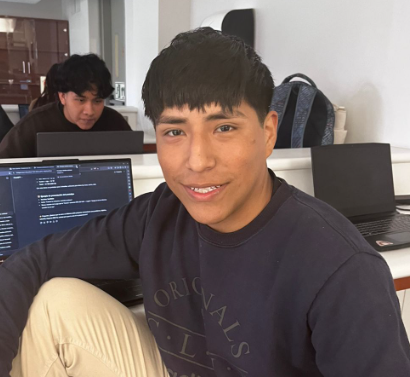

# Equipo 03 - Fundamentos de Diseño 2025-2

**Carrera de Ingeniería Ambiental / Informática / Industrial**
**Universidad Peruana Cayetano Heredia**

---

## 📑 Tabla de Contenidos

* 👥 Descripción del Equipo
* 📸 Fotografía del Equipo
* 🧑‍🤝‍🧑 Integrantes
* 📘 Resumen Final
* 💡 Proyecto: **COOLSENSE**
* 🎯 Objetivos
* 🔍 Funcionamiento General
* 🧩 Componentes del Sistema
* ⚙️ Especificaciones Técnicas
* 🧠 Metodología de Implementación
* 🌡️ Lista de Exigencias
* 💡 Patentes Relacionadas
* 🌱 Impacto Esperado
* 🚀 Misión y Visión
* 📌 Justificación
* ♻️ Alineación con el ODS 12.2
* 📈 Métricas de Impacto
* ⚖️ Marco Legal
* 💰 Costos y Plazos
* 📚 Referencias

---

## 🌍 Descripción del Equipo

Somos el **Equipo 03** del curso **Fundamentos de Diseño 2025-2**, conformado por estudiantes de **Ingeniería Ambiental, Informática e Industrial**.
Buscamos integrar la tecnología con la sostenibilidad, desarrollando soluciones que contribuyan al uso eficiente de los recursos naturales.

**ODS de Enfoque Principal:**

* 🌱 **ODS 12.2:** Lograr la gestión sostenible y el uso eficiente de los recursos naturales.

---

## 📸 Fotografía del Equipo

  

---

## 👥 Integrantes del Equipo

| Foto                                                       | Nombre                              | Rol                             | Intereses                                       |
| ---------------------------------------------------------- | ----------------------------------- | ------------------------------- | ----------------------------------------------- |
|  | **Yhonaiker Ramos Garay**           | Líder del equipo                | Innovación sostenible y automatización          |
|  | **Junior Moises Aliaga Cueva**      | Documentación y control técnico | Comunicación técnica, gestión IoT               |
|  | **Glicerio Leonel Urbano Castillo** | Investigación                   | Energías limpias y optimización ambiental       |
|  | **Pedro Jhair Cueva Tantalean**     | Diseño                          | Prototipado, modelado 3D y electrónica aplicada |

---

## 📘 Resumen Final

### 🌡️ Proyecto: **COOLSENSE**

  

**¿Qué es COOLSENSE?**
COOLSENSE es un **sistema inteligente de monitoreo térmico** diseñado para controlar en tiempo real la temperatura dentro de **camiones y contenedores refrigerados** que transportan productos perecibles como carnes, lácteos y pescados.

A través de sensores digitales de alta precisión y una plataforma web conectada por IoT, el sistema **detecta variaciones térmicas**, emite **alertas automáticas** y registra el historial de datos para **garantizar la calidad e inocuidad de los alimentos.**

---

## 🎯 Objetivos

### 🔹 Objetivo General

Diseñar e implementar un sistema automatizado de monitoreo térmico en tiempo real, que optimice la gestión de la cadena de frío en el transporte de productos perecibles, garantizando su conservación y reduciendo pérdidas económicas y ambientales.

### 🔹 Objetivos Específicos

| Nº | Objetivo                                                                                                                        |
| -- | ------------------------------------------------------------------------------------------------------------------------------- |
| 1  | Desarrollar un dispositivo compacto capaz de medir y transmitir datos de temperatura en tiempo real.                            |
| 2  | Crear un dashboard web intuitivo para visualizar y registrar los datos históricos.                                              |
| 3  | Implementar alertas automáticas ante variaciones fuera del rango óptimo.                                                        |
| 4  | Promover la sostenibilidad mediante la reducción del desperdicio alimentario y el uso eficiente de la energía en refrigeración. |

---

## 🔍 Funcionamiento General

### 💡 Estructura del Sistema

**COOLSENSE** se compone de tres módulos principales:

1. **Módulo Sensorial** 🧊

   * Sensores **DS18B20** y **PT100** para alta precisión térmica.
   * Rango de operación: **-55°C a +125°C**
   * Frecuencia de muestreo ajustable (cada 30 segundos).

2. **Módulo de Control** ⚙️

   * Procesador **ESP32** con conectividad **WiFi**.
   * Algoritmos de control que detectan desviaciones térmicas y activan alertas inmediatas.

3. **Módulo Web (Dashboard)** 💻

   * Interfaz que permite **visualizar datos en tiempo real**, configurar rangos personalizados y descargar reportes históricos.
   * Integración con **Firebase** para almacenamiento y comunicación en la nube.

---

## 🧩 Componentes del Sistema

| Categoría                    | Componente                                | Descripción                                |
| ---------------------------- | ----------------------------------------- | ------------------------------------------ |
| **Sensores**                 | DS18B20 / PT100                           | Medición térmica de alta precisión         |
| **Microcontrolador**         | ESP32                                     | Procesamiento y transmisión de datos       |
| **Comunicación**             | WiFi                          | Conectividad y localización en tiempo real |
| **Energía**                  | Batería recargable 1000mAh + respaldo 24h | Autonomía y seguridad                      |
| **Software**                 | Dashboard Web + App móvil                 | Visualización, configuración y alertas     |
| **Material del dispositivo** | Carcasa IP67                              | Resistente a agua, golpes y polvo          |
| **Almacenamiento**           | Firebase / MySQL                          | Registro histórico de temperatura          |

---

## ⚙️ Especificaciones Técnicas

| Parámetro             | Especificación                        |
| --------------------- | ------------------------------------- |
| Dimensiones           | ≤ 12 × 8 × 5 cm                       |
| Peso                  | 500 g                                 |
| Precisión del sensor  | ±0.2°C (PT100) / ±0.5°C (DS18B20)     |
| Intervalo de muestreo | 30 s (ajustable)                      |
| Comunicación          | WiFi / GSM / Bluetooth                |
| Rango térmico         | -55°C a +125°C                        |
| Protección ambiental  | IP67                                  |
| Consumo energético    | 0.001727 mA                           |
| Autonomía             | Hasta 6.6 años con batería de 1000mAh |
| Puerto de carga       | USB-C                                 |

---

## 🧠 Metodología de Implementación

| Etapa                              | Acción Principal                                        | Duración   | Resultado                                    |
| ---------------------------------- | ------------------------------------------------------- | ---------- | -------------------------------------------- |
| **Investigación**                  | Análisis de la cadena de frío y necesidades del cliente | 4 semanas  | Identificación de puntos críticos de control |
| **Diseño y prototipo 3D**          | Modelado en ON SHAPE y fabricación con impresora 3D     | 6 semanas  | Prototipo funcional resistente y ergonómico  |
| **Programación e integración IoT** | Conexión de sensores y dashboard                        | 10 semanas | Sistema operativo con alertas en tiempo real |
| **Validación y pruebas piloto**    | Ensayos en transporte real (pescados y carnes)          | 8 semanas  | Validación de confiabilidad del sistema      |
| **Optimización final**             | Ajuste del diseño, software y consumo energético        | 2 semanas  | Versión lista para producción                |

---

## 🌡️ Lista de Exigencias

📄 Documento completo disponible en: [`Recursos/Documentos/Lista_de_Exigencias.pdf`](Recursos/Documentos/Lista_de_Exigencias.pdf)

Incluye parámetros de:

* Cinemática y geometría
* Energía y comunicaciones
* Control, software, seguridad y ergonomía
* Fabricación, montaje y mantenimiento
* Costos y plazos

---

## 💡 Patentes Relacionadas

| Título                                                                                         | País / Código | Descripción                                                          | Año  |
| ---------------------------------------------------------------------------------------------- | ------------- | -------------------------------------------------------------------- | ---- |
| Dispositivo inalámbrico de monitoreo de temperatura con caja de conservación de calor portátil | CN112027358A  | Sistema de detección y alarma térmica para cajas de frío             | 2020 |
| Sistema de cadena de frío conectado con IoT y Big Data                                         | CN112856910A  | Control y registro de temperatura con RFID e inteligencia artificial | 2021 |
| Método y sistema para determinar la frescura del producto                                      | US11061421B2  | Etiquetado automático y trazabilidad térmica                         | 2021 |

---

## 🌱 Impacto Esperado

| Dimensión      | Impacto                                                        |
| -------------- | -------------------------------------------------------------- |
| **Ambiental**  | Reducción del desperdicio de alimentos por fallas térmicas     |
| **Económico**  | Ahorro en pérdidas logísticas y mantenimiento                  |
| **Social**     | Garantía de alimentos seguros y frescos                        |
| **Sostenible** | Fomento del uso eficiente de energía en transporte refrigerado |

---

## 🚀 Misión

Implementar tecnologías IoT sostenibles que garanticen la inocuidad y trazabilidad térmica en la cadena de frío, promoviendo la eficiencia energética y la reducción de desperdicios.

## 🔮 Visión

Convertirnos en un referente nacional en innovación para la logística alimentaria inteligente, contribuyendo al cumplimiento del **ODS 12.2** mediante soluciones tecnológicas sostenibles.

---

## 📌 Justificación

La pérdida de alimentos por deficiencias en refrigeración representa un grave problema logístico y ambiental.
**COOLSENSE** busca minimizar este impacto mediante un sistema que permite **control, trazabilidad y reacción inmediata ante fallas térmicas**, asegurando la calidad de los productos y la sostenibilidad de la cadena alimentaria.

---

## ♻️ Alineación con el ODS 12.2

| Meta ODS                                         | Aporte de COOLSENSE                                     |
| ------------------------------------------------ | ------------------------------------------------------- |
| **12.2.1 - Uso eficiente de recursos naturales** | Control del consumo energético en refrigeración         |
| **12.3 - Reducción del desperdicio alimentario** | Alertas térmicas automáticas que evitan pérdidas        |
| **12.5 - Prevención de residuos**                | Monitoreo continuo para optimizar la logística          |
| **12.8 - Educación y conciencia ambiental**      | Dashboard informativo sobre impacto y ahorro energético |

---

## 📈 Métricas de Impacto

| Indicador                            | Método                    | Frecuencia |
| ------------------------------------ | ------------------------- | ---------- |
| Temperatura promedio mantenida       | Registro IoT              | Diario     |
| Reducción de desperdicio alimentario | Comparativa antes/después | Mensual    |
| Nivel de satisfacción de usuarios    | Encuestas NPS             | Trimestral |
| Ahorro energético                    | Análisis comparativo      | Semestral  |

---

## ⚖️ Marco Legal

Basado en:

* **Decreto Legislativo N° 1290** – Inocuidad de alimentos industrializados y productos pesqueros
* **Decreto Legislativo N° 1062** – Ley de Inocuidad Alimentaria
* **Ley N° 30988** – Reducción y prevención de pérdidas alimentarias

---

## 💰 Costos y Plazos

| Parámetro                       | Detalle                 |
| ------------------------------- | ----------------------- |
| **Costo estimado por unidad**   | S/ 400                  |
| **Duración total del proyecto** | 138 horas               |
| **Plazo de entrega**            | 09 de diciembre de 2025 |
| **Responsables**                | MS, LN, YK              |

---

## 📚 Referencias

1. Naylamp Mechatronics. *Tutorial sensor digital DS18B20.* (2023).
2. Pires L.M. et al. *Low-Power IoT System for Continuous Temperature Monitoring.* Designs (2025).
3. Cil A.Y. et al. *Real-time cold chain monitoring in ports.* J. Shipping Trade (2022).
4. Wang X. et al. *Flexible sensing in fruit cold chains.* Materials Today Sustainability (2023).
5. SPÍJ Perú. *Normas legales sobre inocuidad alimentaria.* (2025).

---

*Documento elaborado por el **Equipo 03 - Fundamentos de Diseño 2025-2***
*Universidad Peruana Cayetano Heredia*

